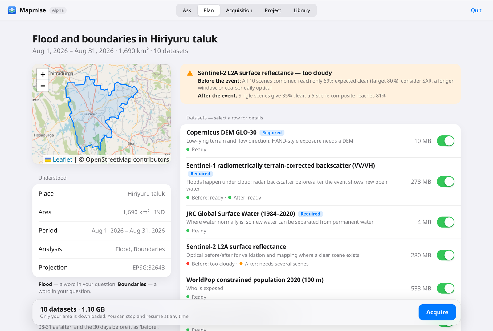
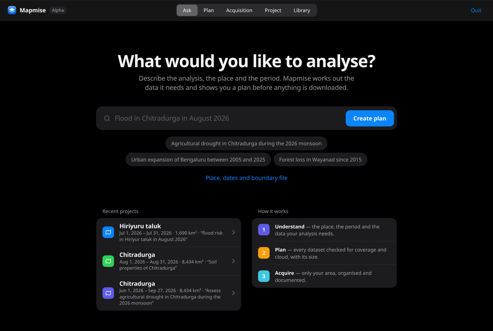
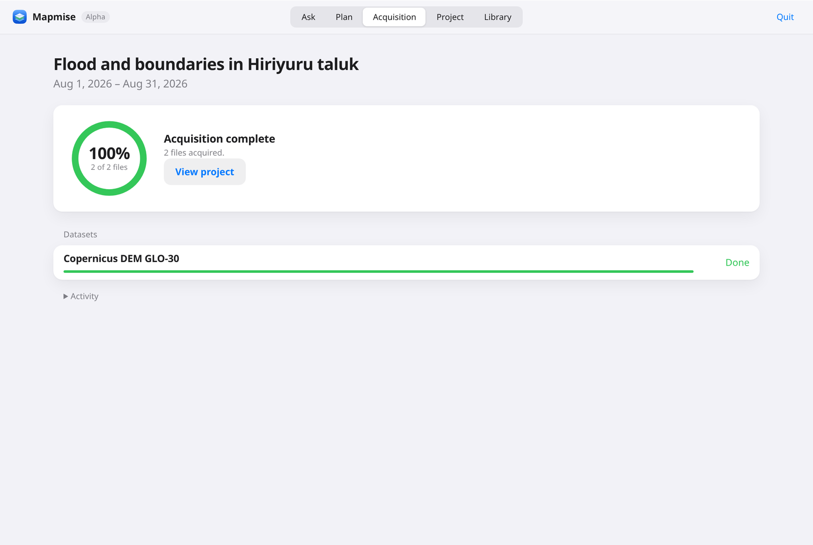

<div align="center">


# Mapmise

**Analysis-ready open geospatial data, from a single question.**

[](https://github.com/AiM0-create/mapmise/releases)
[](https://github.com/AiM0-create/mapmise/actions/workflows/tests.yml)
[](LICENSE)


</div>

Mapmise determines which open datasets an analysis requires, verifies that they are usable for the stated area
and period, acquires only the area of interest, and delivers the result as an organised, dated and fully documented
project — ready for QGIS, Python or any GIS.

It runs entirely on your computer. There is no account, no hosted service and no API key.

<p align="center"></p>

> *Mise en place* is the discipline of preparing and arranging every ingredient before cooking begins.
> Mapmise applies it to spatial analysis.

---

## Contents

- [Overview](#overview)
- [Installation](#installation)
- [Getting started](#getting-started)
- [How a question becomes a dataset](#how-a-question-becomes-a-dataset)
- [Reading a plan](#reading-a-plan)
- [Project structure](#project-structure)
- [Data registry](#data-registry)
- [Language understanding](#language-understanding)
- [Personal library and recipes](#personal-library-and-recipes)
- [Command-line reference](#command-line-reference)
- [Limitations](#limitations)
- [Contributing](#contributing)
- [Licence and attribution](#licence-and-attribution)

---

## Overview

Every spatial analysis is preceded by the same preparatory work: identifying the appropriate datasets, locating
them across catalogues with differing conventions, establishing whether imagery is usable under cloud, acquiring,
clipping and reprojecting it, and recording its provenance. Mapmise performs this work systematically and keeps the
record.

| Capability | Description |
|---|---|
| **From analysis to data** | A question such as *"flood in Chitradurga, August 2026"* is resolved into its data requirements — radar before and after the event, elevation, reference water extent, population, transport — each with a stated rationale. |
| **Feasibility before acquisition** | For each tile and time window, the best scene is selected and assessed. Periods in which optical imagery cannot provide a clear view are reported as *infeasible*, and a cloud-independent alternative is proposed. Where one product does not span the requested years, a second is combined with it, and any remaining gap is reported. |
| **Area-only transfer** | Cloud-optimised sources are read in parallel windows restricted to the area of interest; a 30 km area within a 110 km Sentinel-2 tile transfers roughly one-twelfth of the file. |
| **Provenance as output** | Every file is entered in a static STAC catalogue with its SHA-256 checksum, source URL, query and selection rationale, and summarised in a human-readable `REPORT.md`. |

Mapmise is deliberately **not** an analysis tool. It does not compute indices, mask clouds or classify imagery.
Where an open, analysis-ready product exists — terrain-corrected radar backscatter, composited vegetation indices,
land cover, surface-water occurrence — that product is delivered as published.

Nothing is downloaded until the plan has been reviewed and approved.

## Installation

### Desktop application

Download the installer for your system from the
[latest release](https://github.com/AiM0-create/mapmise/releases/latest).

| System | File | Installation |
|---|---|---|
| Windows 10 / 11 (64-bit) | `Mapmise-<version>-windows-x64-setup.exe` | Run the installer. Mapmise is added to the Start menu; administrator rights are not required. A portable `.zip` is also provided. |
| macOS, Apple silicon | `Mapmise-<version>-macos-arm64.dmg` | Open the disk image and drag Mapmise to Applications. |
| macOS, Intel | `Mapmise-<version>-macos-x64.dmg` | As above. |
| Linux (64-bit) | `Mapmise-<version>-linux-x64.AppImage` | Mark the file as executable (`chmod +x`) and open it. A `.tar.gz` is also provided. |

Mapmise opens in its own window and runs entirely on your computer; close the window to quit. On Linux the window
requires the system web view (WebKitGTK); where it is not available, Mapmise opens in your default browser instead.

**Unsigned builds.** Pre-release installers are not yet code-signed, and the operating system will ask for
confirmation on first launch:

- **Windows** — in the *Windows protected your PC* dialog, choose **More info**, then **Run anyway**.
- **macOS** — dismiss the dialog, open **System Settings → Privacy & Security**, and choose **Open Anyway**.

Every release is built from this repository by a [public workflow](.github/workflows/release.yml) that tests each
build on its own operating system — including a live acquisition — before publication. `SHA256SUMS.txt` lists the
checksum of every file.

To verify an installation:

| System | Command |
|---|---|
| Windows | `"%LOCALAPPDATA%\Programs\Mapmise\mapmise-cli.exe" selftest` |
| macOS | `/Applications/Mapmise.app/Contents/MacOS/mapmise-cli selftest` |
| Linux | `./Mapmise-<version>-linux-x64.AppImage cli selftest` |

### Python package

For command-line use and scripting, with Python 3.12 or later:

```bash
pip install mapmise-0.1.0a1-py3-none-any.whl pywebview   # from the release page; pywebview adds the app window
mapmise selftest
```

From source:

```bash
git clone https://github.com/AiM0-create/mapmise.git
cd mapmise
python -m venv .venv && .venv/bin/pip install -e ".[dev]"
.venv/bin/python -m pytest -q
```

GDAL is provided by the rasterio wheel; no separate installation is needed. QGIS is optional and is located
automatically on the `PATH`, in the standard Windows installation folders, or in the macOS Applications folder.

## Getting started

### In the application

<p align="center"> </p>

1. **Ask** — describe the analysis, the place and the period in plain language. A boundary file, dates or an event
   date may be supplied instead of, or in addition to, the text.
2. **Plan** — review what was understood, the area on a map, and every proposed dataset with its verdict, size and
   rationale. Exclude datasets, substitute alternative sources, then approve.
3. **Acquisition** — progress is shown per source. Acquisition may be interrupted and resumed at any time.
4. **Project** — review what the project contains, what could not be obtained and why, and the acquisition report.
   Open everything in QGIS in one step, or pose a further question about the same area.

Projects are created in `~/mapmise-projects` unless another workspace is chosen.

### From the command line

```bash
mapmise ask "I heard a flood happened in Chitradurga in August 2026"
```

```
understood:
  place   “Chitradurga” → Chitradurga, Karnataka, India (boundary/administrative, relation/2020623)
          8,434 km², IND, project CRS EPSG:32643
  period  2026-08-01 → 2026-08-31  ← “august 2026”
  asks    flood → 9 data needs

need                         source                         files     est.  verdicts
elevation/static             cop-dem-glo-30                     4    36 MB  static=single
sar/pair                     sentinel-1-rtc                     8  1.08 GB  pre=single, post=single
water/static                 jrc-gsw-occurrence                 6    12 MB  static=single
optical/pair                 sentinel-2-l2a                    16  1.45 GB  pre=infeasible, post=composite
population/static            worldpop-constrained-2020          1  0.53 GB  static=single
…
Verdicts needing your attention:
  sentinel-2-l2a pre: all 19 scenes combined reach only 70% expected clear (target 80%) …

fetch 9 source(s) into ./chitradurga-2026-08? [y/N]
```

Further examples:

```bash
mapmise ask "Assess agricultural drought in Chitradurga during the 2026 monsoon"
mapmise ask "Urban expansion of Bengaluru between 2005 and 2025" --dry-run
mapmise ask "Forest loss in Wayanad since 2015"
mapmise ask "Hospital and school access in Tumakuru district"
```

## How a question becomes a dataset

```
question ──► understanding ──► data needs ──► source selection ──► feasibility plan ──► approval ──► acquisition ──► catalogue + report
            place, period,     from ask       ranked by coverage,   scenes per tile       (you)        area-only,        STAC, SHA-256,
            analysis           rules          readiness, cloud-     and window, with                    one projection,   REPORT.md
                                              independence          verdicts and sizes                  resumable
```

- **Understanding** is deterministic for places and dates: the place is resolved to an administrative boundary
  through OpenStreetMap, and dates are parsed from the sentence. Both are shown for confirmation and may be
  overridden.
- **Data needs** are derived from ask rules — plain YAML mapping analyses to generic needs such as
  *elevation, static* or *radar, before and after*.
- **Source selection** ranks every registered source against each need by temporal coverage, analysis readiness,
  independence from cloud, and resolution.
- **Planning** queries the catalogues, selects items, estimates transfer sizes and assigns a verdict to every
  window. No data is transferred at this stage.
- **Acquisition** reads only the area of interest, writes Cloud-Optimised GeoTIFFs and GeoPackages in a single
  UTM projection, and records a checksum for every file. Reprojection uses nearest-neighbour resampling, so every
  output value exists in the source.

## Reading a plan

Each source receives a verdict for every time window:

| Verdict | Meaning |
|---|---|
| `single` | One scene or product per tile covers the area with sufficient clear view. |
| `composite` | A clear view requires several scenes; the plan states how many. |
| `infeasible` | No combination of available scenes reaches the clear-view target — typically optical imagery during a monsoon. A cloud-independent alternative is added where one exists. |
| `incomplete` | The area is not fully imaged in the window, a file has not yet been published, or a query exceeds its limit. |
| `out-of-range` | The product's record does not extend to that year; another source is combined with it where possible. |

Periods longer than approximately eighteen months are planned per year; shorter periods per month. Before-and-after
requirements use the event date given, one found in the question, one reported by GDACS, or — stated explicitly —
the requested period as the *after* window.

## Project structure

```
chitradurga-2026-08/
├── project.json          area, period, country, projection and boundary provenance
├── aoi/aoi.geojson
├── requests/<id>.json    the question, derived needs, selected and alternative sources, unmet needs
├── plans/<id>.json       per source: catalogue query, selected items and URLs, verdicts, estimates,
│                         and the execution log with a SHA-256 checksum per file
├── catalog/              static STAC catalogue (QGIS 3.40+: Browser → STAC → catalog/catalog.json)
├── data/<source>/<window>/<item>_<band>.tif     area-clipped Cloud-Optimised GeoTIFFs
├── data/<source>/static/<source>_<layer>.gpkg   clipped vector layers
├── data/vrt/             per-period mosaics with relative paths
└── REPORT.md             the acquisition record in plain language
```

A project folder is self-contained and may be moved, archived or shared.

## Data registry

Twenty-four open sources in the current release, each verified against its provider:

| Theme | Sources |
|---|---|
| Optical | Sentinel-2 L2A (10 m, 2015–) · Landsat 4–9 Collection 2 L2 (30 m, 1982–) |
| Radar | Sentinel-1 RTC (10 m, 2014–) · ALOS PALSAR annual mosaic (25 m, 2015–2021) |
| Vegetation | MODIS 16-day NDVI/EVI (250 m, 2000–) and the optical sources |
| Elevation | Copernicus DEM GLO-30 · NASADEM |
| Water | JRC Global Surface Water occurrence and seasonality · OpenStreetMap waterways |
| Land cover and built-up | ESA WorldCover 2021 (10 m) · Impact Observatory annual LULC (10 m, 2017–2023) · ESA CCI (300 m, 1992–2020) |
| Forest | Hansen/UMD Global Forest Change 2000–2025 |
| Temperature | MODIS 8-day land surface temperature (1 km) |
| Fire | MODIS burned area (500 m, to July 2025) |
| Precipitation | CHIRPS monthly (0.05°) |
| Soil | ISRIC SoilGrids 2.0 (250 m) |
| Population | WorldPop constrained 2020 (100 m) |
| Boundaries | geoBoundaries ADM1 and ADM2 |
| Transport, buildings, facilities | OpenStreetMap via Overpass |
| Events | GDACS |

`mapmise sources --check` probes every entry live. A new dataset is a single YAML entry, written from the
provider's own documentation; see [CONTRIBUTING.md](CONTRIBUTING.md).

## Language understanding

Mapmise includes a compact sentence-embedding model (23 MB, Apache-2.0) that runs offline on the CPU. It allows
questions to be phrased freely. The sentence

> *"Farmers near Hiriyur lost their groundnut because it barely rained in July 2026"*

contains no analytical keyword, yet is understood as a drought question, with the reason shown:

```
drought   (meaning: close to “farmers lost their harvest because it did not rain” (0.62))
rainfall  (keyword)
```

The model selects only among existing ask rules and always states its reasoning. It cannot introduce a dataset,
scene, date or place; everything downstream is deterministic. On a held-out evaluation set it raised correct
understanding from 11 of 17 questions (keywords alone) to 16 of 17 ([docs/EXPERIMENTS.md](docs/EXPERIMENTS.md),
E5). It can be disabled with `--no-ai`.

## Personal library and recipes

Every acquired file is indexed in a personal library across projects.

- **Exact reuse.** A file already held is used in place of a download only when doing so yields identical pixels:
  the same scene and band, on the source's native grid, in the required projection, fully covering the new area.
  A district acquired earlier can supply a sub-district later with no transfer at all. When two scenes are equally
  suitable, the one already held is preferred; a less suitable scene is never chosen for that reason.
- **Inventory by place.** `mapmise library --place "Hiriyur"`, or the Library view in the application.
- **Recipes.** `mapmise recipe export <project>` writes a small file containing the area, the questions, the exact
  items and URLs selected, and their checksums. `mapmise recipe run <recipe> <folder>` rebuilds the dataset and
  reports which files are byte-identical; sources that change by design, such as OpenStreetMap, are identified as such.
- **Refresh.** `mapmise refresh <project>` extends the most recent question to the present day and acquires only
  what is new.

## Command-line reference

| Command | Purpose |
|---|---|
| `mapmise ask "<question>"` | Understand, plan, and — after approval — acquire |
| `mapmise gui [--browser]` | Open the application in its own window, or in the browser |
| `mapmise status <project>` | What the project holds, what is missing, and why |
| `mapmise run <project>` | Resume or retry acquisition; completed files are skipped |
| `mapmise open <project>` | Build mosaics and open all layers in QGIS |
| `mapmise report <project>` | Regenerate `REPORT.md` |
| `mapmise library` | Inventory of everything acquired, across projects |
| `mapmise recipe export \| run` | Share or rebuild a project as a recipe |
| `mapmise refresh <project>` | Extend the latest question to today |
| `mapmise sources [--theme T] [--check]` | List, or live-verify, the data registry |
| `mapmise rules` | The vocabulary of ask rules |
| `mapmise selftest [--offline]` | Verify the installation |

Options for `ask`:

| Option | Effect |
|---|---|
| `--place "Tumakuru, Karnataka"`, `--pick N` | Resolve a different place name, or choose another match |
| `--aoi area.gpkg` | Use a boundary file instead of a place name |
| `--start YYYY-MM-DD --end YYYY-MM-DD` | Set the period explicitly |
| `--event YYYY-MM-DD` | Exact event date for before-and-after requirements |
| `--skip THEME:TEMPORAL` | Exclude a requirement, e.g. `buildings:static` |
| `--use THEME:TEMPORAL=SOURCE` | Require a particular source for a requirement |
| `--mode composite` | Acquire enough optical scenes per window to reach the clear-view target |
| `--project DIR` | Project location; an existing project accumulates further questions |
| `--dry-run`, `--yes` | Plan without acquiring; or approve without prompting |
| `--no-ai` | Use keyword rules only |

## Limitations

This is an alpha release. Known limitations:

- Understanding is limited to English and to the analyses described by the ask rules; a question matching no rule
  is reported as such.
- No soil-moisture source is included yet; the open products require a NASA Earthdata login.
- OpenStreetMap building queries are limited by area, and public Overpass servers may be slow; `mapmise run` retries.
- WorldPop does not support partial reads, so the national file is downloaded once and cached.
- The Planetary Computer token service rate-limits anonymous use; Mapmise backs off and retries. Setting
  `PC_SDK_SUBSCRIPTION_KEY` raises the limit.
- Expected clear coverage is estimated from scene-level cloud statistics, not per-pixel masks.
- Installers are not yet code-signed.

## Contributing

Mapmise's domain knowledge resides in two YAML files — the data registry and the ask rules — so most contributions
require no code. See [CONTRIBUTING.md](CONTRIBUTING.md) for the standards applied to new sources, including the
requirement that each entry be written from the provider's own documentation and pass a live check.

Design rationale and evaluation: [docs/PRODUCT_DISCOVERY.md](docs/PRODUCT_DISCOVERY.md) ·
[docs/EXPERIMENTS.md](docs/EXPERIMENTS.md).

## Licence and attribution

Mapmise is licensed under the [Apache License 2.0](LICENSE). Bundled third-party components are listed in
[THIRD_PARTY_NOTICES.md](THIRD_PARTY_NOTICES.md).

Mapmise downloads data but does not redistribute it. Each dataset retains its provider's licence, which is recorded
in the registry, in every catalogue item and in each project's `REPORT.md`. Boundaries resolved from place names
and map tiles are © OpenStreetMap contributors (ODbL).
